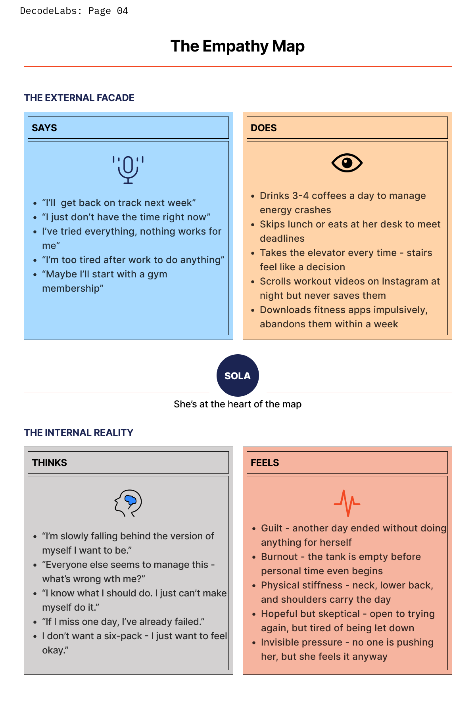
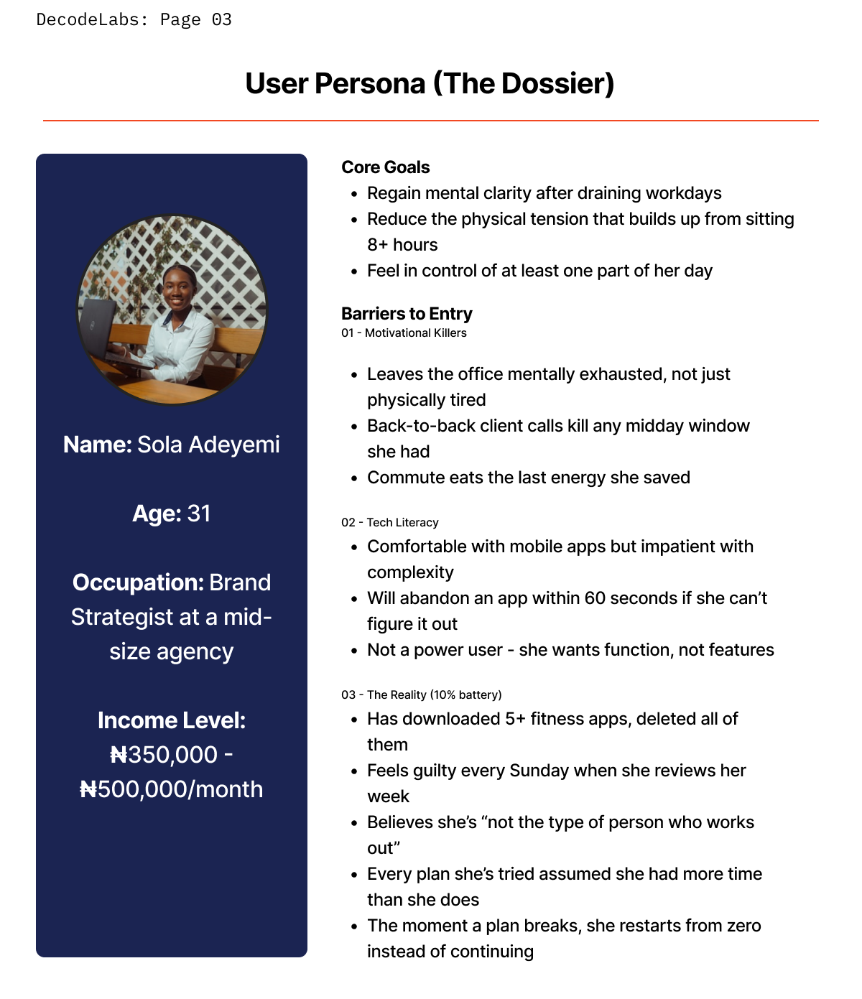
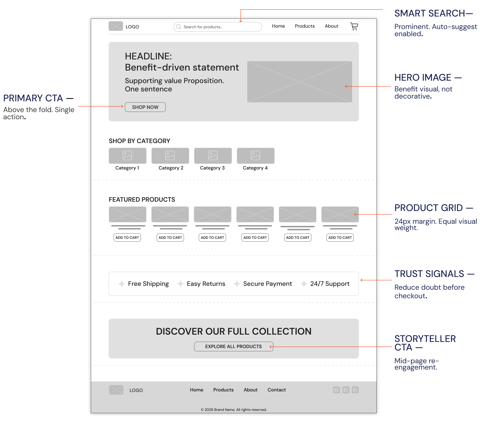
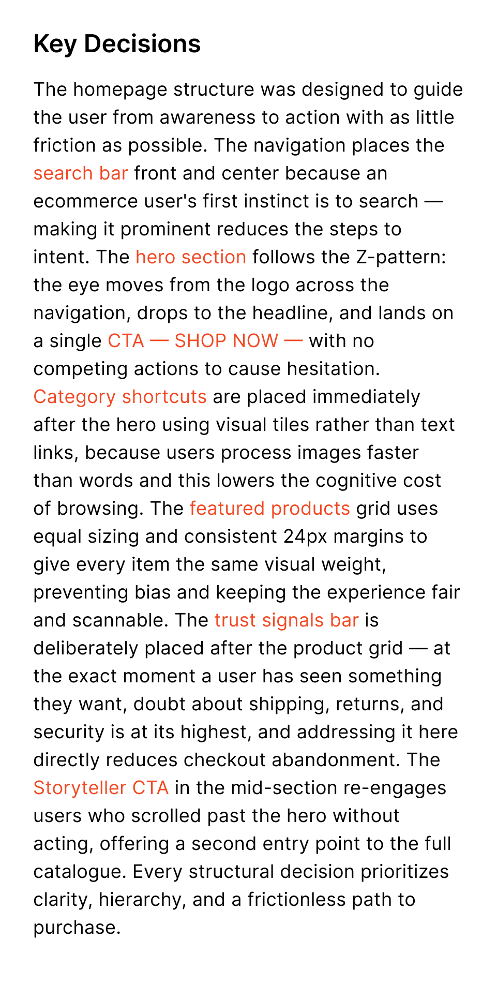
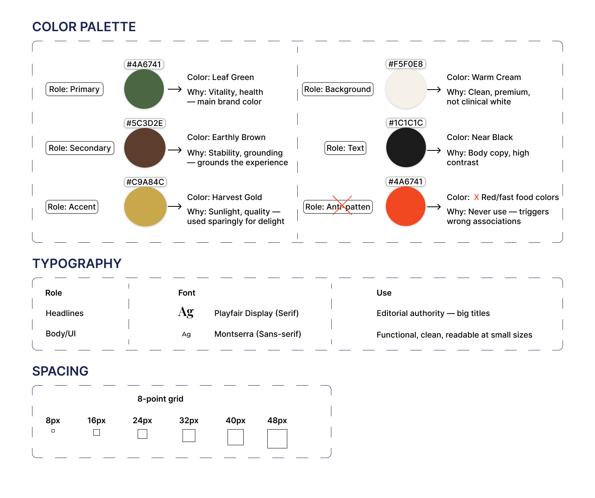
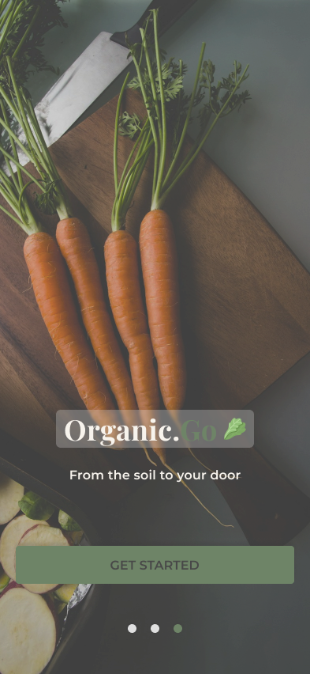
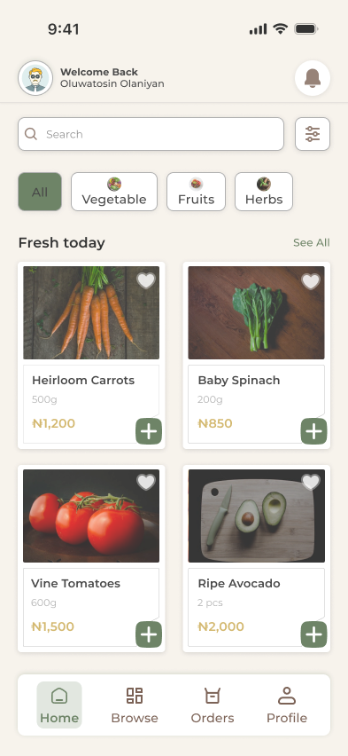
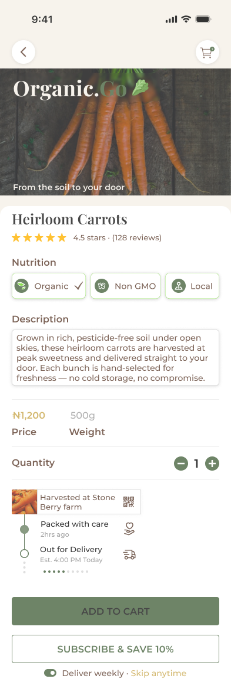

# DecodeLabs UI/UX Internship — Batch 2026
### Oluwatosin Olaniyan | UI/UX Product Designer

A collection of hands-on UI/UX design projects completed during my 
4-week industrial training internship at DecodeLabs (Batch 2026). 
Each project builds on the last — from UX research through to 
high-fidelity visual design.

---

## Projects Overview

| Project | Title | Focus | Tool |
|---|---|---|---|
| 01 | The Empathy Map | UX Research & Personas | FigJam |
| 02 | The Blueprint | Lo-Fi Wireframing | Figma |
| 03 | The Visual Identity | Hi-Fi UI Design | Figma |

---

## Project 1 — The Empathy Map

**Brief:** A fitness startup wants to launch an app for busy office 
professionals who struggle to find time for exercise. Before designing 
a single pixel, the team needed to understand the user's real pain.

**My Role:** UX Researcher

**What I Did:**
- Defined the target audience (time-poor professionals, ages 25–40)
- Created a detailed User Persona: Sola Adeyemi, 31, Brand Strategist
- Built a 4-quadrant Empathy Map (Says / Thinks / Does / Feels)
- Identified the core insight: the problem isn't discipline — it's friction

**Key Insight:**
> Sola doesn't have a discipline problem. She has a design problem. 
> Every solution she's encountered was built for someone with more 
> time, more energy, and more forgiveness in their schedule.

**Deliverable:** FigJam board — 5 frames

🔗 [View Full Project on Figma](https://www.figma.com/board/G918HrmTamnS6OC8u4sweO/DecodeLabs-Project-1?node-id=0-1&t=EKyHRI6CDg6Rhvkd-1) ← paste your Figma link here

---

## Project 2 — The Blueprint

**Brief:** An e-commerce brand is losing customers during checkout. 
The layout is cluttered, and users are confused. They need a clean, 
logical structure for their landing page.

**My Role:** UX/UI Designer

**What I Did:**
- Analysed the 3 core friction points causing abandonment
- Designed a full lo-fi homepage wireframe at 1440px desktop
- Applied Z-pattern layout for natural eye flow
- Placed CTAs strategically: above fold, mid-page, and footer
- Annotated every key decision with reasoning

**Key Decision:**
> The trust signals bar is deliberately placed after the product grid — 
> at the exact moment a user has seen something they want, doubt is 
> at its highest. Addressing it there directly reduces abandonment.

**Deliverable:** Figma file — wireframe + annotations + key decisions

🔗 [View Full Project on Figma](https://www.figma.com/design/oCRIQALuQtTjCnUzEVxzU0/DecodeLabs-Projects?node-id=51-5&t=12nYL9xdvthgiJsn-1)

---

## Project 3 — The Visual Identity

**Brief:** A premium organic food delivery service needs a brand 
identity that communicates trust, health, and speed through 
colors and typography.

**My Role:** Lead Visual Designer

**What I Did:**
- Built a complete design system (color palette, typography, spacing)
- Followed the 8-point grid across all screens
- Designed 3 key screens: Splash, Product List, Product Detail, and their wireframes
- Incorporated the Trust Engine: Farm-to-Table Tracking, 
  Digital Certification and Flexible Subscriptions
- Used North Window Light imagery direction throughout

**Design System:**
| Token | Value |
|---|---|
| Primary | Leaf Green `#4A6741` |
| Secondary | Earthy Brown `#5C3D2E` |
| Accent | Harvest Gold `#C9A84C` |
| Background | Warm Cream `#F5F0E8` |
| Headlines | Playfair Display (Serif) |
| Body | Montserrat (Sans-serif) |
| Grid | 8-point system |

**Deliverable:** Figma file — design system + 3 hi-fi screens

🔗 [View Full Project on Figma](https://www.figma.com/design/oCRIQALuQtTjCnUzEVxzU0/DecodeLabs-Projects?node-id=130-226&t=12nYL9xdvthgiJsn-1)

---

## Tools Used

- **Figma** — wireframing, hi-fi design, prototyping
- **FigJam** — UX research, empathy mapping
- **Unsplash** — authentic food photography

---

## About Me

I'm Oluwatosin Olaniyan, an early-career UI/UX Product Designer 
based in Lagos, Nigeria. I completed the DecodeLabs Batch 2026 
internship as part of my industrial training, working across 
UX research, information architecture, and visual design.

📧 Connect with me on [LinkedIn](https://www.linkedin.com/in/oluwatosin-olaniyan-59089429b/?lipi=urn%3Ali%3Apage%3Ad_flagship3_profile_view_base_contact_details%3BX%2B%2FnU7KJTEi0LELKGBsJAQ%3D%3D) 
Follow my design journey on [X / Twitter](https://x.com/ItsOlatee) 
